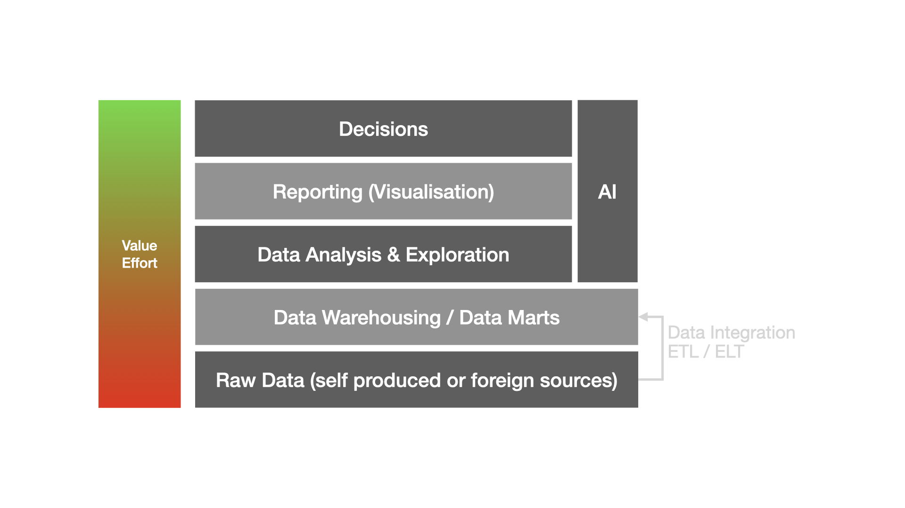

#### business what?

"the ability to apprehend the interrelationships of presented facts in such a way as to guide action towards a desired goal"

Hans Peter Luhn (1958)

---

#### business what?

"business intelligence as an umbrella term to describe concepts and methods to improve business decision making by using fact-based support systems"

Howard Dresner (1989)

---

#### business what?

"business intelligence (BI) is a technology-driven process for analyzing data and delivering actionable information that helps executives, managers and workers make informed business decisions"

Craig Stedman

---

#### gut feeling vs. data-driven decisions

- Fight (1 Group -> gut feeling), other data driven decisions

- [Gut Feeling](https://raybwilliams.medium.com/should-you-trust-logic-and-data-or-gut-feelings-to-make-decisions-d4afcbf987c8)

---

#### Pro gut feeling decisions

---

#### Pro data driven decisions

---

#### but why?

- potentials, competitors, example?

---

#### stages of analysis

---

#### Notes

(business strategy, business processes, business goals, observation, data exploration, iterative process, relevance assessment)
