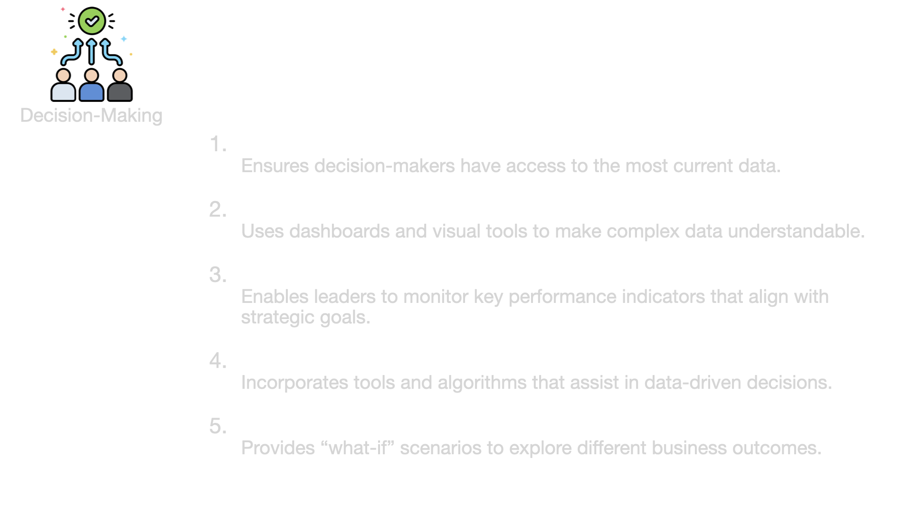
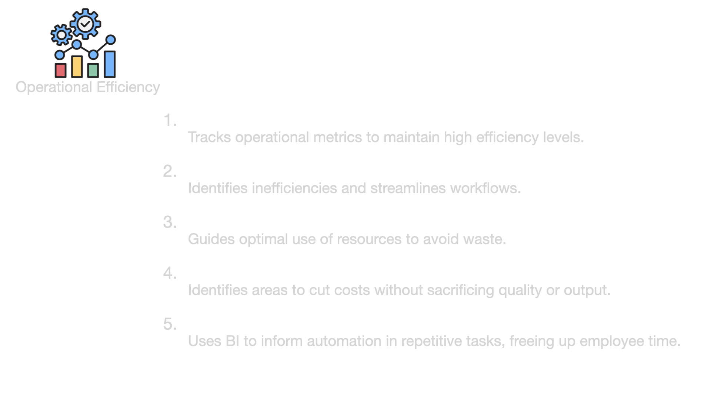
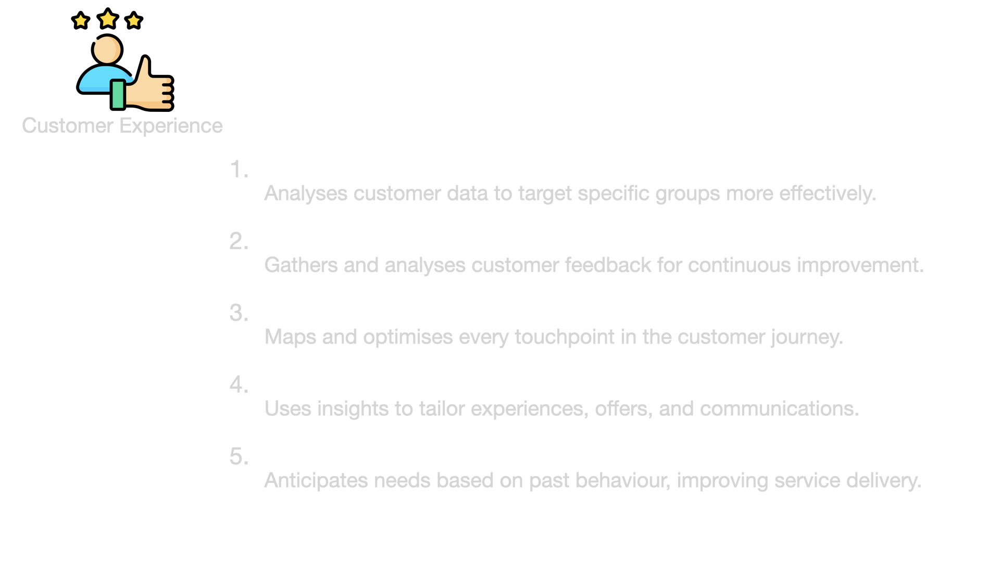
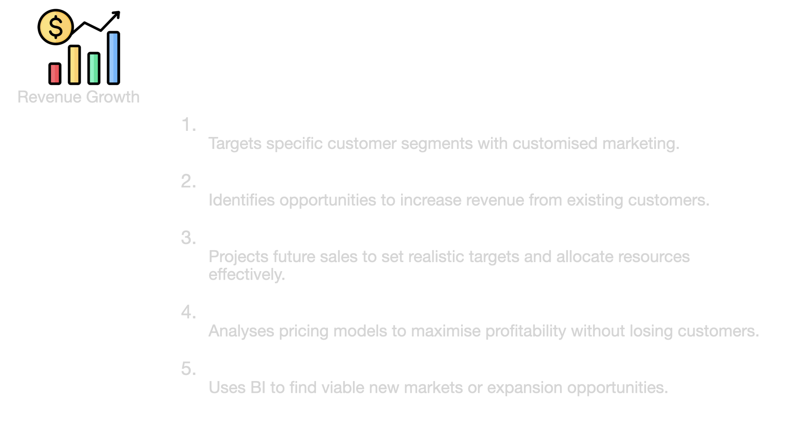
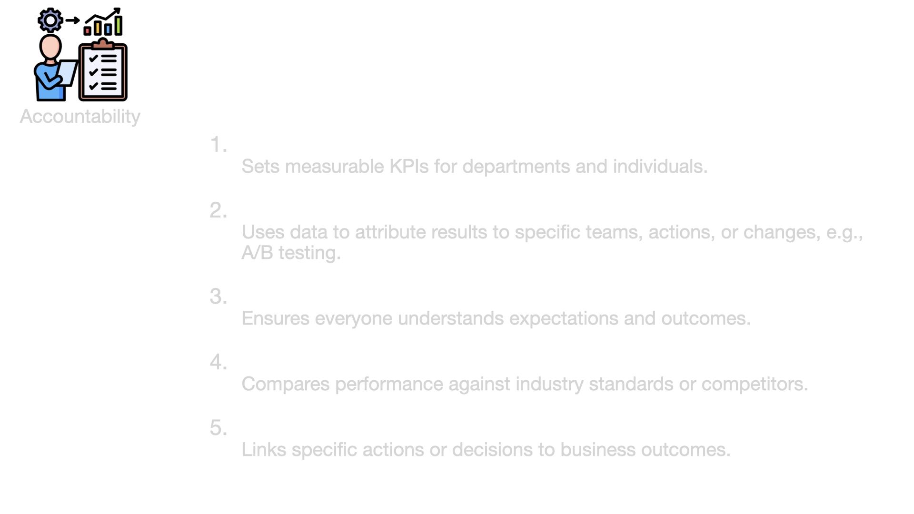
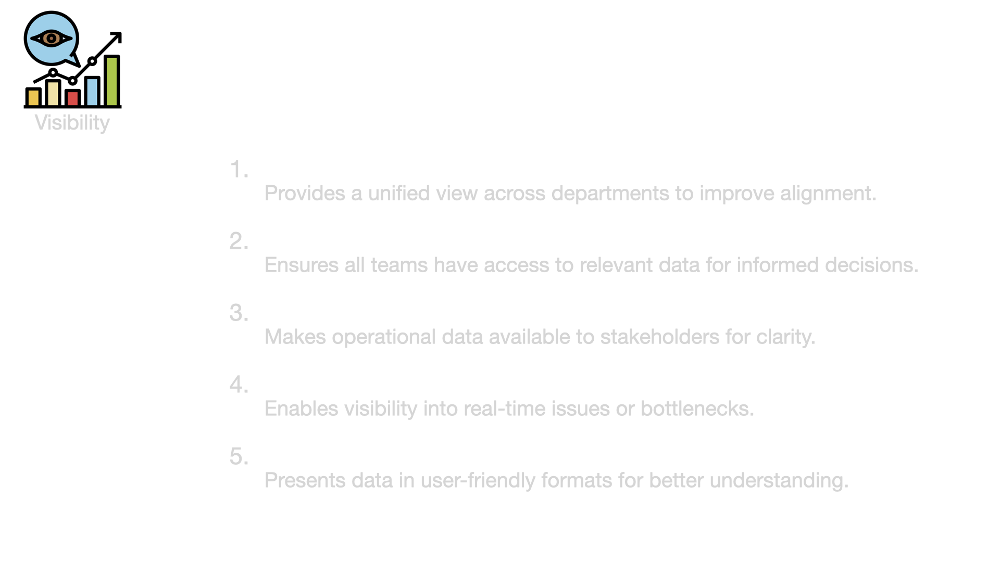
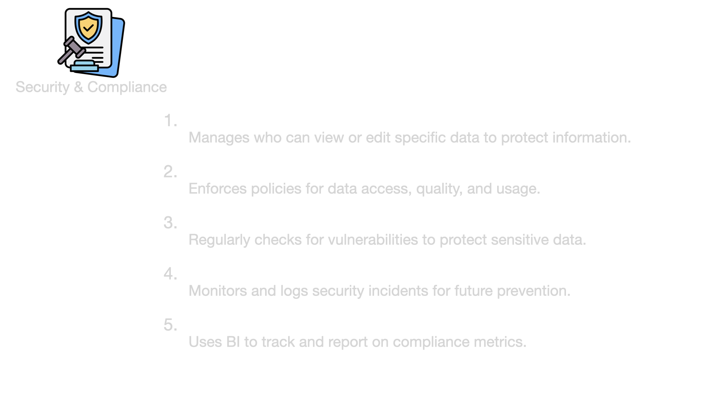
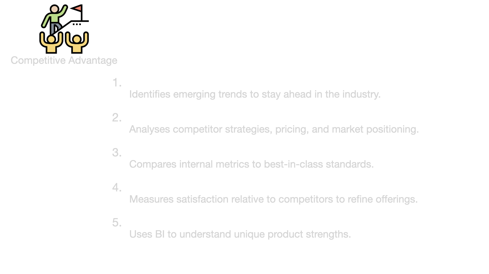
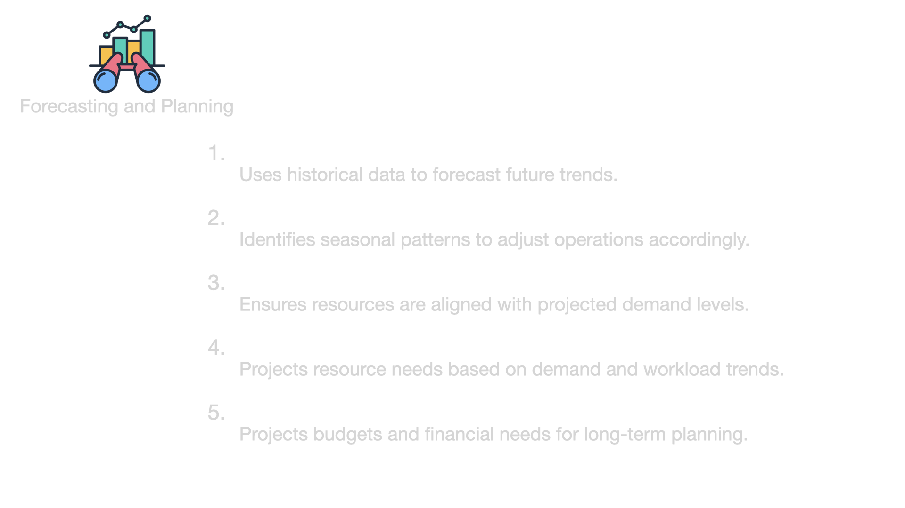

## Two historical examples

- 1910
- https://en.wikipedia.org/wiki/Jim_Simons

---

## BI Goals

--

--

--

--

--

--

--

--

--

--

---

## BI Components

---

## Who does the work?

---

## Decision Making

---

## Organizational BI pitfalls

---

**Lack of Data-Driven Culture**

**Focus**

Cultural or strategic failure to prioritize data in decision-making.

[Literature](https://www.datacamp.com/blog/how-to-create-data-driven-organization?dc_referrer=https%3A%2F%2Fwww.google.com%2F)

--

**Explanation**

This refers to an organization’s broader inability to incorporate data into its core decision-making processes. Even when the infrastructure, teams, and data are present, if decision-makers
do not prioritize or value data-driven insights, BI efforts will fall flat.

--

**Main Issue**

Cultural resistance or indifference toward using data, causing BI initiatives to fail or underperform.

---

**Data Silos**

**Focus**

Separation of data across departments or systems.

[Link](https://estuary.dev/why-data-silos-problematic/)

--

**Explanation**

Data silos occur when different teams or departments have their own isolated data systems that are not easily shared or integrated with the rest of the organization.

--

**Main Issue**

Lack of data integration, which hinders comprehensive analysis and BI.

---

**Organizational Silos**

**Focus**

Lack of communication and collaboration between departments.

[Literature](https://www.investopedia.com/terms/s/silo-mentality.asp#:~:text=In%20business%2C%20organizational%20silos%20refer,shared%20because%20of%20system%20limitations)

--

**Explanation**

This term refers to a broader isolation within an organization, where departments (like Data Science, IT, Marketing, Sales) operate independently, often driven by different objectives. Even if the data is accessible, the organizational culture or structure prevents teams from working together effectively.

--

**Main Issue**

Disconnection between departments, causing strategic misalignment and inefficiency in BI efforts.

---

**Business-Data Disconnect**

**Focus**

Misalignment between data insights and business objectives.

[Literature](https://medium.com/geekculture/what-to-do-when-business-and-data-teams-are-disconnected-ecc717d9affc)

--

**Explanation**

This describes the gap when data teams don’t fully understand business needs, or decision-makers don’t know how to leverage data effectively. Even when the data is integrated, insights generated by data scientists might be irrelevant or misaligned with what the business needs.

--

**Main Issue**

Mismatch between the focus of data scientists and the real-world business goals, leading to poor decision-making support.

---

**Shadow BI**

**Focus**

Unsanctioned BI practices within departments.

[Literature](https://www.fastloop.ai/insights/eliminate-shadow-bi)

--

**Explanation**

This occurs when departments or individuals start using their own BI tools and processes without involving the central data science or BI teams. It usually happens because official processes are seen as too slow or misaligned with business needs, so teams create their own ad hoc analysis, often using unverified data.

--

**Main Issue**

Lack of oversight, consistency, and data quality control, leading to potential inaccuracies and risk in decision-making.

---

**And more**

- Decision-Action Gap
- Data Governance Issues
- Communication Gaps
- Technology Lag

Note:

- Decision-Action Gap: Decision-makers fail to act on data-driven insights, even when they are available. This could be due to hesitation, lack of trust in the data, or resistance to change.
- Data Governance Issues: Problems related to managing the availability, usability, integrity, and security of data. This includes unclear data ownership, inconsistent data standards, and poor data quality, which can hinder BI efforts.
- Communication Gaps: This refers to poor communication between data scientists and decision-makers, resulting in misunderstandings or ineffective translation of insights into business actions.
- Technology Lag: When organizations have outdated or insufficient technology for handling modern BI practices. Even with a good data team and strong business collaboration, old systems can prevent effective BI.
- ...

---

Notes

(business strategy, business processes, business goals, observation, data exploration, iterative process, relevance assessment, on-premise vs. cloud, AB-Testing)

Task / Group Work: Descripe a company, assuming the students are a consultant, what would you propose to change in order to get a real data-driven company and stay ahead of competition?
