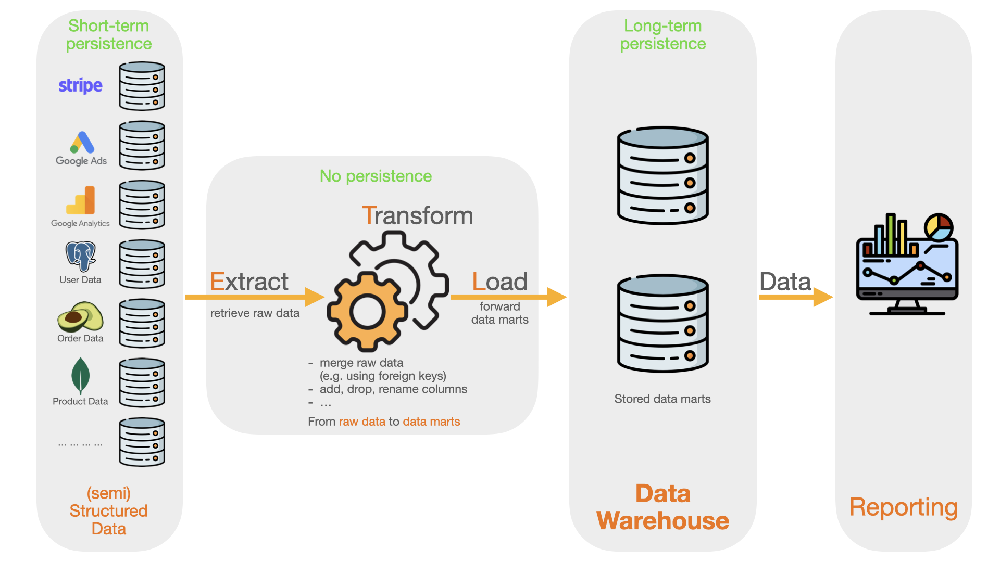

Where are we located during the lecture?

---

Outlook

- The focus / goals of data management
- Data management architectures
- Deep-dive into lyvy's lakehouse architecture
- Deep-dive into a realtime architecture
- Viktor CASE

---

The focus / goals of data management

---

**Data Quality**

- Goal: Ensure the accuracy, consistency, completeness, and reliability of data.
- Why It Matters: High-quality data is essential for informed decision-making, reducing errors, and building trust in analytics.
- Key Activities:
  - Data cleansing to remove errors or duplicates.
  - Standardizing data formats and enforcing validation rules.
  - Continuous monitoring to detect and address quality issues.

--

**Data Security**

- Goal: Protect data from unauthorized access, breaches, and misuse.
- Why It Matters: Data breaches can lead to financial losses, legal consequences, and reputational damage.
- Key Activities:
  - Implementing encryption and secure access controls.
  - Regular security audits and vulnerability assessments.
  - Complying with regulations like GDPR, HIPAA, or CCPA.

--

**Data Accessibility**

- Goal: Ensure the right data is available to the right people at the right time.
- Why It Matters: Enhances productivity and decision-making by providing timely access to relevant data.
- Key Activities:
  - Implementing role-based access control (RBAC).
  - Developing intuitive data catalogs and search tools.
  - Minimizing data silos with integrated platforms.

--

**Data Governance and Compliance**

- Goal: Establish policies and processes for consistent, compliant, and ethical data usage.
- Why It Matters: Ensures legal compliance and ethical standards while reducing risk.
- Key Activities:
  - Creating data usage policies and training employees.
  - Documenting data lineage to track its origins and transformations.
  - Ensuring audit readiness with proper documentation.

--

**Scalability**

- Goal: Build systems and processes that handle growing data volumes and complexity without degradation in performance.
- Why It Matters: Organizations need to adapt to increasing data demands as they grow.
- Key Activities:
  - Using scalable storage and compute solutions (e.g., cloud platforms, distributed databases).
  - Implementing efficient ETL pipelines.
  - Designing data architectures for horizontal scaling.

--

Short excursion: Horizontal vs. Vertical scaling.

--

**Data Integration**

- Goal: Seamlessly combine data from multiple sources into a unified view.
- Why It Matters: Allows for comprehensive insights and avoids fragmented decision-making.
- Key Activities:
  - Using ETL/ELT tools to consolidate data.
  - Maintaining metadata and master data management practices.
  - Standardizing APIs and protocols for data exchange.

--

**Data Availability and Continuity**

- Goal: Minimize downtime and ensure data availability during disruptions.
- Why It Matters: Business operations rely on uninterrupted access to critical data.
- Key Activities:
  - Implementing redundancy and failover systems.
  - Conducting regular backups and testing recovery processes.
  - Using high-availability systems and disaster recovery plans.

--

**Usability and Data Democratization**

- Goal: Enable non-technical users to access and understand data.
- Why It Matters: Promotes data-driven decision-making across all levels of an organization.
- Key Activities:
  - Providing self-service BI tools.
  - Creating user-friendly dashboards and visualizations.
  - Offering training on data literacy.

--

**Usability and Data Democratization**

- Goal: Enable non-technical users to access and understand data.
- Why It Matters: Promotes data-driven decision-making across all levels of an organization.
- Key Activities:
  - Providing self-service BI tools.
  - Creating user-friendly dashboards and visualizations.
  - Offering training on data literacy.

--

Cost Efficiency

- Goal: Minimize expenses related to storing, processing, and managing data while maintaining performance and scalability.
- Why It Matters: Reduces operational costs, supports scalability within budget constraints, and enables businesses to allocate resources more effectively to other critical areas.
- Key Activities:
  - It's your turn! What are cost drivers considering data infrastructures?

--

Summary: data management provides the foundations for (operational) BI

---

Data management architectures

---

Data Warehouse

--

--

Pros & Cons

---

Data Lake

--

--

---

Hybrid Data Lake

--

--

---

Data Lakehouse

--

--

---

Don't think of these architectures as being set in stone. They all have advantages and disadvantages
and are applied in modified forms.

---

Deep-dive into lyvy's lakehouse architecture

---

#### Story

- https://sigma.software/about/media/how-to-choose-the-best-type-of-data-storage-architecture

---

- Finops
- Data Availability (Retention time)
- live vs. prelive / staging vs. live
- snowflake vs. clickhouse
