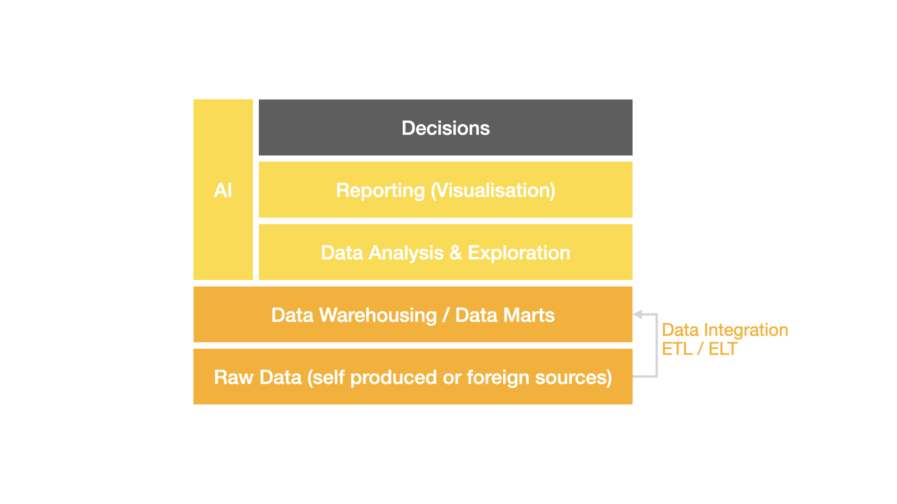

Where are we located during the lecture?

---

Outlook

- The main goals of a suitable data storage architecture
- Data storage architectures and lots of new terms
- Deep-dive into lyvy's lakehouse architecture
- Deep-dive into a realtime architecture
- Viktor CASE

---

Main Goals

--

Time-to-insight & Query Response Time

Leveraging efficient storage solutions significantly accelerates query processing and data retrieval. Faster access to insights empowers businesses to promptly identify inefficiencies or seize opportunities, enabling quicker and more effective decision-making.

--

Data Availability

Streamlined access to data ensures it is readily available precisely when needed. This enhances operational efficiency and supports informed, timely decision-making, ultimately improving the overall quality of business strategies.

--

Cost Efficiency

Optimized storage solutions minimize expenses associated with hardware, cloud infrastructure, and software licenses. They also provide businesses with the flexibility to scale their systems up or down based on demand, ensuring cost-effectiveness and adaptability within a manageable budget.

---

Data Warehouse

--

--

Estimate the complexity at

- requirement for ???

---

#### Story

- https://sigma.software/about/media/how-to-choose-the-best-type-of-data-storage-architecture

---

- Finops
- Data Availability (Retention time)
