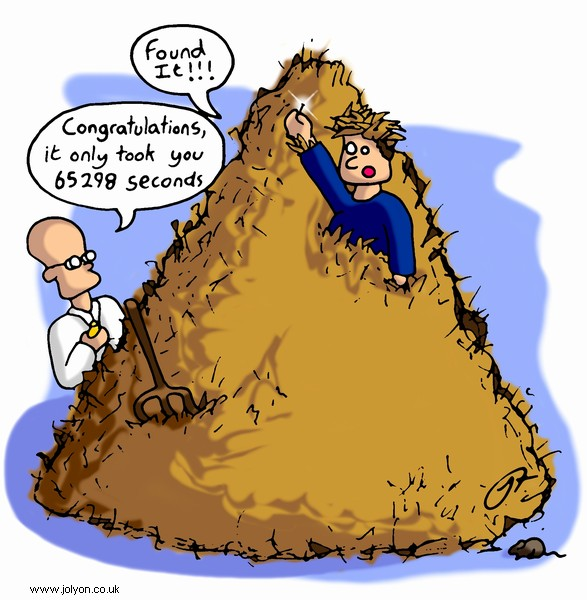
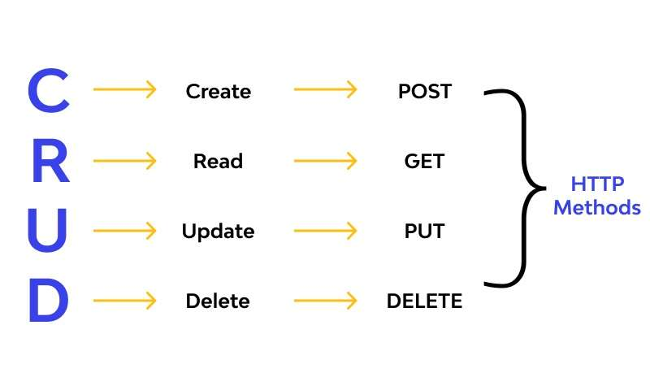

Is a file system all you need to store information?

- include figure keynote

Note:
ask for: what is the task of a file system (see next slide)

---

What is the task of a file system?

--

- bringing order to digital chaos
  - files and folders
  - metadata like creation date or file size

--

- efficient data operation
  - e.g. read in an excel file
  - e.g. make a change and save it

---

What are those operations?

---

Is a file system all you need to store information?

--

No because of the no free lunch theorem:

- optimization towards certain tasks are tradeoffs
- optimizing read operations might lead to slower write operations
- faster write operations might lead to faster read operations
- ...

---

What is a data base and what is it good for?

--

What is a data base?

- TODO: include img keynote

--

What is it good for?

- efficient CRUD operations
- ACID criteria guarantee
- storage efficiency
- scalability

---

How can the efficiency of **CRUD** operations be influenced?

--

What is slow and what is fast?

- accessing data by the row number / row index is fast
  - direct access to memory location
  - e.g. given a data table returning row number 7
- accessing data by column values is slow
  - iterate through rows, read and compare
  - e.g. given a data table with a column _name_ returning the row where _name_ equals Henry

--

Alert

!!row index is not the same like an index of a data table!!

---

Example

Assume we have a large data table with _n_ entries:

| first_name | last_name | age | weight | ... |
| ---------- | --------- | --- | ------ | --- |
| Jack       | Sparrow   | 41  | 71     | ... |
| Hector     | Barbossa  | 63  | 74     | ... |
| Elizabeth  | Swann     | 32  | 53     | ... |
| ...        | ...       | ... | ...    | ... |

--

We want to get all rows given a last name.

How can we do that?

--

Most obvious: iterate through the rows one step after another and
check for equality with the given last name

What is the worst case number of steps we need?

--

Worst case scenario: last name is not in the data table

--

Complexity (Linear Search)

| Time                                       | Space                                      |
| ------------------------------------------ | ------------------------------------------ |
| _O_(n) | _O_(1) |

--

Short Insertion: What is the complexity of accessing data by a row number?

--

Time / Space Complexity (Direct Access)

| Time                                       | Space                                      |
| ------------------------------------------ | ------------------------------------------ |
| _O_(1) | _O_(1) |

--

Back to our example:
Can we do better?

--

assume our data table is sorted according to the last name

--

TODO: binary / B Tree search

--

Remember: no free lunch theorem

What is the tradeoff?

--

TODO sort algorithm

--

TODO: Real world: B Tree: short explanation and why

--

TODO: Exercise with pandas

---

#### ACID

- group work: 4 groups, each one is studying one of the 4 ACID criteria, explaining it to the course and providing an example
- ACID (https://www.youtube.com/watch?app=desktop&v=GAe5oB742dw&ab_channel=ByteByteGo)

---

#### meta data

- schema

---

#### Relational Databases

---

#### Document Databases

---

#### Key-Value Stores

---

#### Graph Databases

---

#### Others

- Column-Family Databases
- Time-Series Databases
- Object Databases
- Multimodel Databases
- NewSQL Databases

---

#### Comparison Overview
