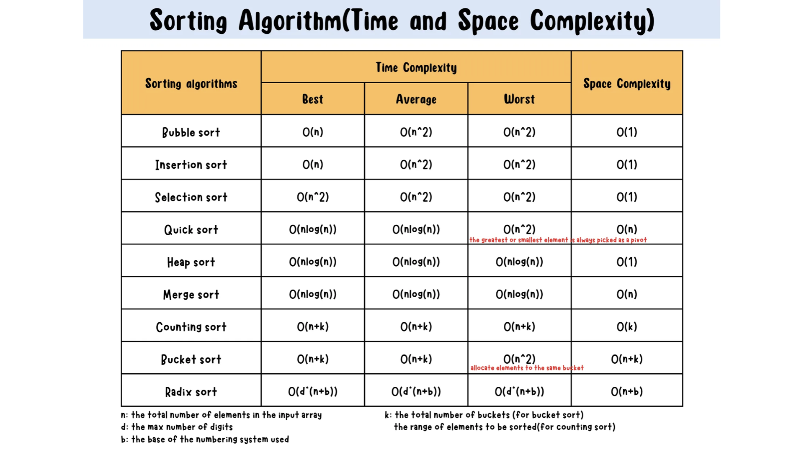
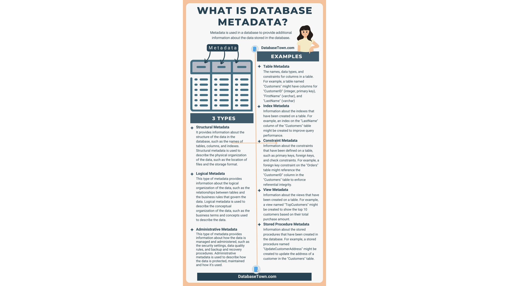
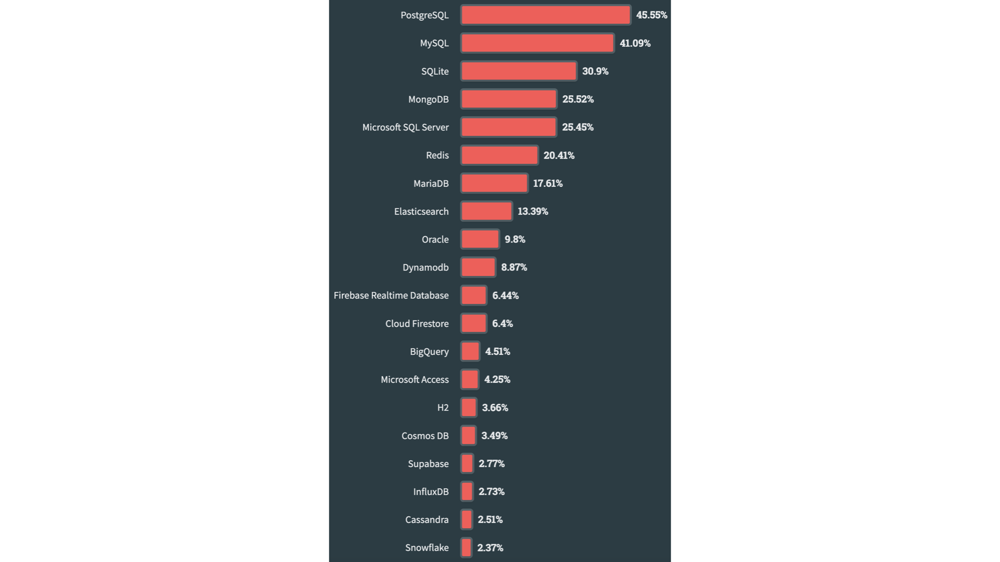

Is a file system all you need to store information?

Note:
ask for: what is the task of a file system (see next slide)

---

What is the task of a file system?

--

- bringing order to digital chaos
  - files and folders
  - metadata like creation date or file size

--

- efficient data operation
  - e.g. read in an excel file
  - e.g. make a change and save it

---

What are those operations?

---

Is a file system all you need to store information?

--

No because of the no free lunch theorem:

- optimization towards certain tasks are tradeoffs
- optimizing read operations might lead to slower write operations
- faster write operations might lead to slower read operations
- ...

---

What is a data base and what is it good for?

--

What is a data base?

--

What is it good for?

- efficient CRUD operations
- ACID criteria guarantee
- storage efficiency
- scalability

---

How can the efficiency of **CRUD** operations be influenced?

--

What is slow and what is fast?

A case study of a row-oriented database

--

 Fast 

- accessing data by the row number / row index is fast
  - direct access to memory location
  - e.g. given a data table returning row number 7
- in-memory access of data

--

 Slow 

- accessing data by column values can be slow (in row-oriented databases)
  - iterate through rows, read and compare
  - e.g. given a data table with a column _name_ returning the row where _name_ equals Henry
- disk-based access of data

--

Example

Assume we have a large data table with _n_ entries:

| row_index | first_name | last_name | age | weight | ... |
| --------- | ---------- | --------- | --- | ------ | --- |
| 1         | Jack       | Sparrow   | 41  | 71     | ... |
| 2         | Hector     | Barbossa  | 63  | 74     | ... |
| 3         | Elizabeth  | Swann     | 32  | 53     | ... |
| ...       | ...        | ...       | ... | ...    | ... |

--

Given a last name, we want to get the relevant row.

How can we do that?

--

Most obvious: iterate through the rows one step after another and
check for equality with the given last name

What is the worst case number of steps we need?

--

Worst case scenario: last name is not in the data table

--

Complexity (Linear Search)

| Time                                       | Space                                      |
| ------------------------------------------ | ------------------------------------------ |
| _O_(n) | _O_(1) |

Note:

Give an intuitive understanding of `the big O notation`

--

Short Insertion: What is the complexity of accessing data by a row number?

--

Time / Space Complexity (Direct Access)

| Time                                       | Space                                      |
| ------------------------------------------ | ------------------------------------------ |
| _O_(1) | _O_(1) |

--

Back to our example:
Can we do better?

--
Auxiliary Table:

- consisting of
  - _last_name_
  - _row_id_
- sorted based on _last_name_

--

Binary Search

--

What is the complexity?

--

Complexity (Binary Search)

| Time                                            | Space                                      |
| ----------------------------------------------- | ------------------------------------------ |
| _O_(log(n)) | _O_(1) |

--

Tada, that's what we call an index, but

TODO: binary / B Tree search

--

Alert

!!Row index is not the same as an index of a data table!!

--

Remember: no free lunch theorem

What is the tradeoff?

--

---

<h3>ACID</h>

---

- What are ACID transactions?
- Why are they important?
- What are the single parts of ACID?
- What is an example for each of those parts?

Use any source to answer these questions.

---

**Atomicity**

--

--

--

Atomicity ensures that a transaction is treated as a single, indivisible unit of work. Either all the changes made by the transaction are committed to the database, or none of them are.

---

**Consistency**

--

--

--

Consistency ensures that a transaction brings the database from one valid state to another. The integrity constraints and rules defined for the database are maintained before and after the transaction.

---

**Isolation**

--

--

Isolation ensures that the execution of one transaction is isolated from the execution of other transactions.

---

**Durability**

--

--

Durability ensures that once a transaction is committed, its effects persist even in the event of system failures. The changes made by a committed transaction are permanent and survive system crashes or power outages.

---

<h3>Meta data</h>

---

Prepare for a little question round using the wikipedia article about [metadata](https://en.wikipedia.org/wiki/Metadata)!

--

Describe in your own words what metadata is. Is it exclusively defined for databases?

--

What categories exist and are they relevant for databases? Try to find examples regarding databases.

--

...

--

[Source](https://databasetown.com/what-is-database-metadata-examples-types/)

---

<h3>Primary and Foreign Keys</h>

---

**Primary Keys**

... typically a **unique** index, but why?

--

Ensuring Uniqueness

- A primary key uniquely identifies each row in a table, ensuring that there are no duplicate rows. This is crucial for tables that represent entities with distinct identities (e.g., users, products, orders), as it helps prevent data redundancy and ambiguity.
- Without a primary key, it can be challenging to distinguish between records, particularly if two or more rows have identical values across all columns.

--

Referential Integrity

- When other tables reference a table, they often use a **foreign key** that points to the primary key in that table.
- Without a primary key, linking data across multiple tables becomes inconsistent and complex, as there’s no guaranteed, unique identifier to reference.

--

Efficient Data Access

- e.g. PostgreSQL automatically creates a unique index for the primary key column(s). This index improves the efficiency of lookups, making retrieval of specific records faster.
- If you need to search for specific rows frequently, particularly in large tables, the primary key index allows PostgreSQL to quickly locate rows, improving performance.

--

Update and Delete Operations

- Primary keys simplify and safeguard update and delete operations. For instance, if you want to delete a specific row, a primary key provides a unique reference.
- Without a primary key, you may end up deleting or updating multiple rows unintentionally if they share identical values across columns.

--

Avoiding Data Anomalies

- Without a primary key, the database lacks a strong enforcement mechanism for ensuring each row’s uniqueness, which can lead to data anomalies. These anomalies can cause issues in reporting, data aggregation, and business logic implementation.

--

Remember the table:

| row_index | first_name | last_name | age | weight |
| --------- | ---------- | --------- | --- | ------ |
| 1         | Jack       | Sparrow   | 41  | 71     |
| 2         | Hector     | Barbossa  | 63  | 74     |
| 3         | Elizabeth  | Swann     | 32  | 53     |
| ...       | ...        | ...       | ... | ...    |

What column would you choose as the primary index? Why?

---

**Foreign Keys**

... is used in relational databases like PostgreSQL to establish and enforce relationships between tables, ensuring referential integrity across your data.

--

Maintaining Referential Integrity

- A foreign key in one table points to a primary key (or unique key) in another table, creating a link between the two. This link enforces referential integrity by ensuring that records in the referencing table (the one with the foreign key) correspond to valid records in the referenced table.

--

Preventing Orphaned Records

- Foreign keys prevent orphaned records by enforcing that any record in a child table must have a corresponding record in the parent table. Without a foreign key constraint, it’s possible to delete or update data in the parent table without updating the child, leading to orphaned records (child records without a valid parent).

--

Enforcing Data Consistency Across Tables

- Foreign keys ensure that related data in different tables remains consistent. They prevent actions that could break the logical relationships within your data, like inserting an order with a non-existent customer_id.

--

Supporting Cascading Actions

- Foreign keys can be set up to cascade certain actions, like ON DELETE CASCADE or ON UPDATE CASCADE. This means that if a record in the parent table is deleted or updated, all related records in the child table will be automatically deleted or updated to match, maintaining consistency.
- Cascading actions can simplify maintenance of related data, reducing the need for complex operations to keep data consistent.

--

Improving Querying and Logical Structure

- Foreign keys make relationships between tables explicit, which helps both the database engine and developers understand the logical connections within the data.
- They allow you to write queries that utilize these relationships, such as using JOIN operations, which are faster and easier to manage when relationships are clearly defined and enforced.

---

Example: Primary and Foreign Keys

The customer, order and product chain. Let's be a data engineer.

--

| customer_id | first_name | last_name |
| ----------- | ---------- | --------- |
| 1           | Viktor     | Atalla    |
| 2           | Christoph  | Baldow    |
| 3           | Peter      | Parker    |
| ...         | ...        | ...       |

Given a customer table, what should the primary key? Do we need a foreign key?

--

| customer_id | first_name | last_name |
| ----------------------------------------------- | ---------- | --------- |
| 1                                               | Viktor     | Atalla    |
| 2                                               | Christoph  | Baldow    |
| 3                                               | Peter      | Parker    |
| ...                                             | ...        | ...       |

- Primary Key
- Foreign Key

--

Create some fictitious tables with to goal to efficiently combine orders with customers and products. Define primary and foreign keys for each of the designed tables.

--

Order - Customer - Relation

| order_id | customer_id | date       | gross costs |
| -------------------------------------------- | ----------------------------------------------- | ---------- | ----------- |
| 1                                            | 1                                               | 2024-11-01 | 23.06       |
| 2                                            | 2                                               | 2024-11-05 | 12.74       |
| 3                                            | 1                                               | 2024-10-02 | 31.57       |
| ...                                          | ...                                             | ...        |

- Primary Key
- Foreign Key

--

Order - Product - Relation

| order_id | product_id | amount |
| -------------------------------------------- | ---------------------------------------------- | ------ |
| 1                                            | 1                                              | 2      |
| 1                                            | 3                                              | 1      |
| 3                                            | 2                                              | 5      |
| ...                                          | ...                                            | ...    |

- Primary Key
- Foreign Key

--

---

Homework: What other key types exists? Explain them!

---

<h3>Different types of databases</h>

---

Relational Databases (rdb)

- all examples up to this point were examples for relational databases
- relational databases are a structured approach to data storage, using tables to organize and link data
- typically implements transactions (ACID)
- based on the relational model

--

**Origins of Relational Databases**

- Developed in the 1970s by Edgar F. Codd at IBM.
- Codd’s Relational Model paper in 1970 laid the foundation.
- Goals: data consistency, ease of use, and support for complex queries.
- Key players: IBM’s System R and Oracle as early adopters.

--

**Relational Model / Core Concepts**

- Table (Relation): Structure holding rows and columns (like a spreadsheet).
- Rows (Tuples): Each row represents a unique record.
- Columns (Attributes): Each column represents a specific property (e.g., “name,” “age”).
- Primary Key: Unique identifier for each row.
- Foreign Key: Links rows across different tables.

--

**How Relational Databases Work**

- Data stored in tables; tables linked via keys.
- Relational databases use SQL (Structured Query Language) to manage data.
- SQL supports CRUD operations (Create, Read, Update, Delete).
- Benefits of structure: reduces redundancy and supports complex data retrieval.

--

**Data Relationships in Relational Databases**

- One-to-One Relationship: Each record in Table A is linked to one in Table B.
- One-to-Many Relationship: A single record in Table A relates to multiple records in Table B.
- Many-to-Many Relationship: Records in Table A relate to multiple records in Table B (typically using a linking table).

--

What is the relationship?

- order to product
- product to order
- product to manufacturer
- advertisement to product

--

**SQL**

- Core SQL Standard: defines features the rdb should support, e.g. SELECT, INSERT, UPDATE or DELETE
- ANSI/ISO has released multiple versions of SQL over the years: SQL-86, SQL-89, ..., SQL:2023
- Additional Vendor Specific Extensions, e.g. Postgres, Mysql, ...
- **However:** We concentrate on Pandas. Why? Because Pandas is powerful and more intuitive for beginners!

---

Document Databases

- one of the main categories of NoSQL databases

---

Graph Databases

---

#### Others

- Key-Value Stores
- Column-Family Databases
- Time-Series Databases
- Object Databases
- Multimodel Databases
- NewSQL Databases

---

The [Stackoverflow Survey](https://survey.stackoverflow.co/2023/#most-popular-technologies-database) about the most popular databases in 2024

---

#### Object storages

https://blog.min.io/databases-for-object-storage/

---

#### Comparison Overview
